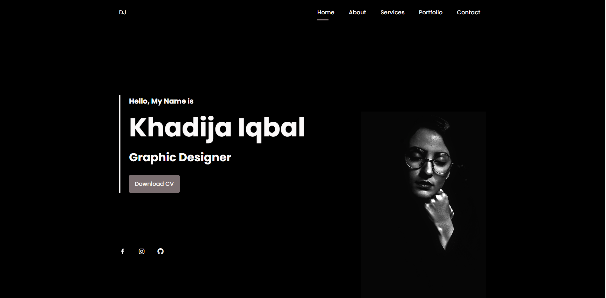

  

<h1 align = "center">DJ Portfolio</h1>

This is a simple HTML, CSS, JS based portfolio with responsive embedded code. With a toggling navbar and changing theme side, this portfolio provides a complete decent website portfolio look that market demands.
 
The user simply have to visit this website to access all the features. Once the url is accepted, the web will appear. Firstly the home sction is displayed and in it, the user wil first encounter a greeting message and blacked navigation bar. Once the user starts to scrol, the nav will change its color to white as the respective background color is changed to white. The user will also be provided the facility to download the client's CV in order to hire her. The <strong>About</strong> section is going to help the viewser understand something about the client and the technical information will also be displayed here. In the <strong>Qualification</strong> section ,the sighees will be elightened about the qualification and some of the best resurces that the client used to enhance her knowldge and suprredom. In the next section, i.e. <strong>Project In Mind</strong>. Here the user will be provided a link to the blog website and the official websit of <strong>DJ</strong> (Client) where the user can check the user's projects details ad also if the user want, then the user can also access the hire my client on the basis of the client's abilities. Moving on the next <strong>Portfolio</strong> section ,here the user will be provided with a list of latest projects that the client has worked on. The list will be a sort of categorized list where a smart animation is added to separate each category from the other. The user has to select the category from the list of categories given at the satrt of this section and on clicking the user will be provided with all the projects related to this category. After that the client's responses are show to the user in order to provide a good impact to the user and get him/her in confidence that the person does have a knowledge. The swiper has been added in this section <strong>Testimonial</strong> for making these responses quite interactive. Then few details have provided in order to contact the websote holder in the <strong>Contact</strong> section. Lastly the footer is made for keeping the rights reserved.
 
On loading, the screen is made in such an interactive way that the elements take time to load and areloaded in an efficient way.

  

Talking about the theme, following are the colors used in the project.
- First Color `#3E0E12`
- First Color Dark `#2F0A0D`
- Text Color `#524748`
- Text Color Light `#7B6F71`
- Text Color Lighten `#FBF9F9`
  

## Features
Follwing are some of the Interesting Features of this website.
- The navigation bar will change its background after some scrolling depending on the background.
- The navlinks will be provided a path to show that which section is curently active on the screen.
- The mixitup library has bee used to categorize the projects of the client and to provide the amazing interface for the users.
- SwiperJS Library has been used in the testimonial section to make the swiping effect on the testimonials.
- The website is adaptable to all types of screens.
- The loading effect on the elements has been added using the JS GreenSock library.
  

## Resources
Following Resources has been used for this project.
- [Box Icons](https://boxicons.com/usage#import-css) For Importing icons intothe project.
- [Google Fonts](https://fonts.google.com/specimen/Poppins?query=pop) for importing the fonts called **Poppins** into the project.
- [Images](/img) can be downloaded from the github.
- [MixItUp](https://www.kunkalabs.com/mixitup/) Library used for categorizing the projects.
- [SwiperJS](https://swiperjs.com/get-started) for swipe effect on the testimonials.
- [GreenSock](https://greensock.com/) to make the loading effect on the elements of the website.
  

## Demo

If you want to visit the demo site of code then you can click on the link given below to access this.
[Khadija Iqbal](https://rebrand.ly/DJPortfolio_MABCORP)
  

## link to Video
  

## GUI

  

## Technology Stack
Following technologies are in use to make this protfolio work completely.
- HTML
- CSS
- JavaScript
- MixItUp
- SwiperJS
- GreenSock lib
  

## Advancement
> The backend for the contact section can be implemented.
  

## Deployement Details
The website is deployed using the free hosting provided by **Vercel**

  
Later on the link was customized using the well known url shortner and customizer **Rebrandly**:  

  

  

## Developer
Muhammad Abdullah Butt  
abdullahbutt12292210@gmail.com  
> [Instagram](https://www.instagram.com/abdullah.butt.22/) 
> [FaceBook](https://www.facebook.com/profile.php?id=100076291614529) 
> [YouTube](https://www.youtube.com/channel/UCnuOFQyMywg-KuoN-lmav1Q) 
> [Portfolio](https://rebrand.ly/muhammadabdullahPortfolio) 
> [Website](#)
